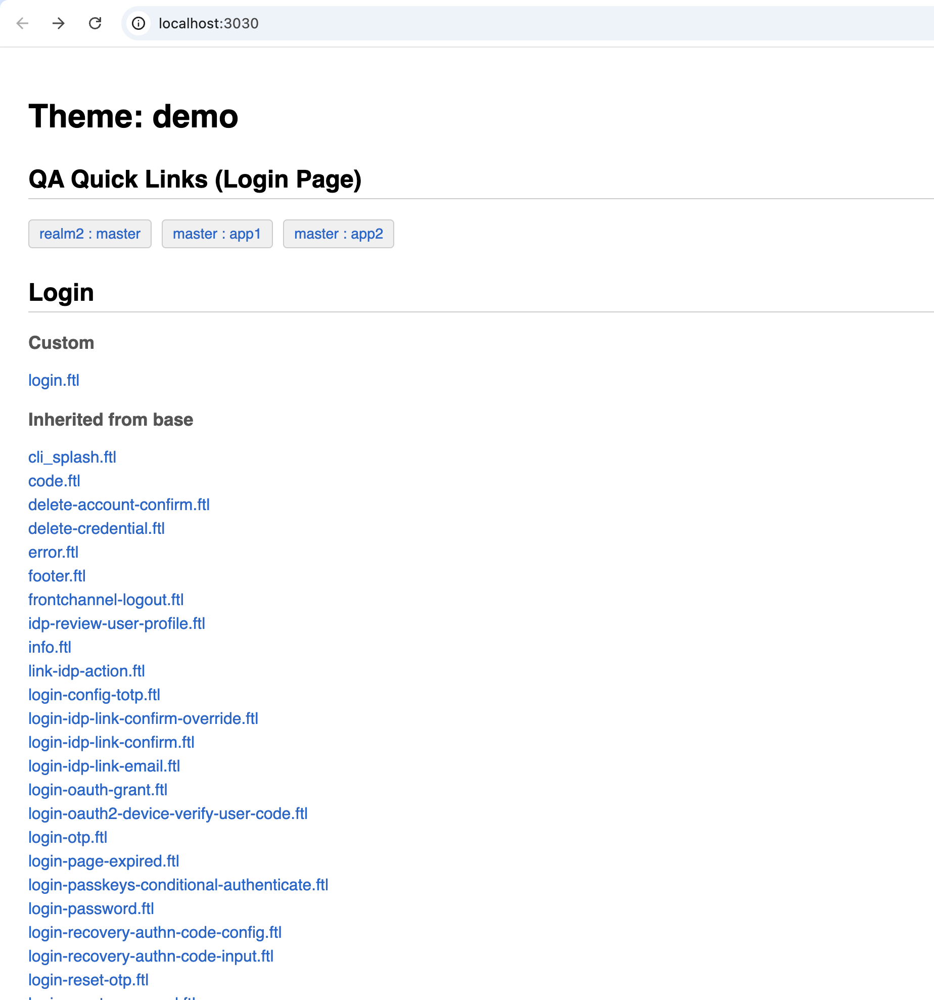
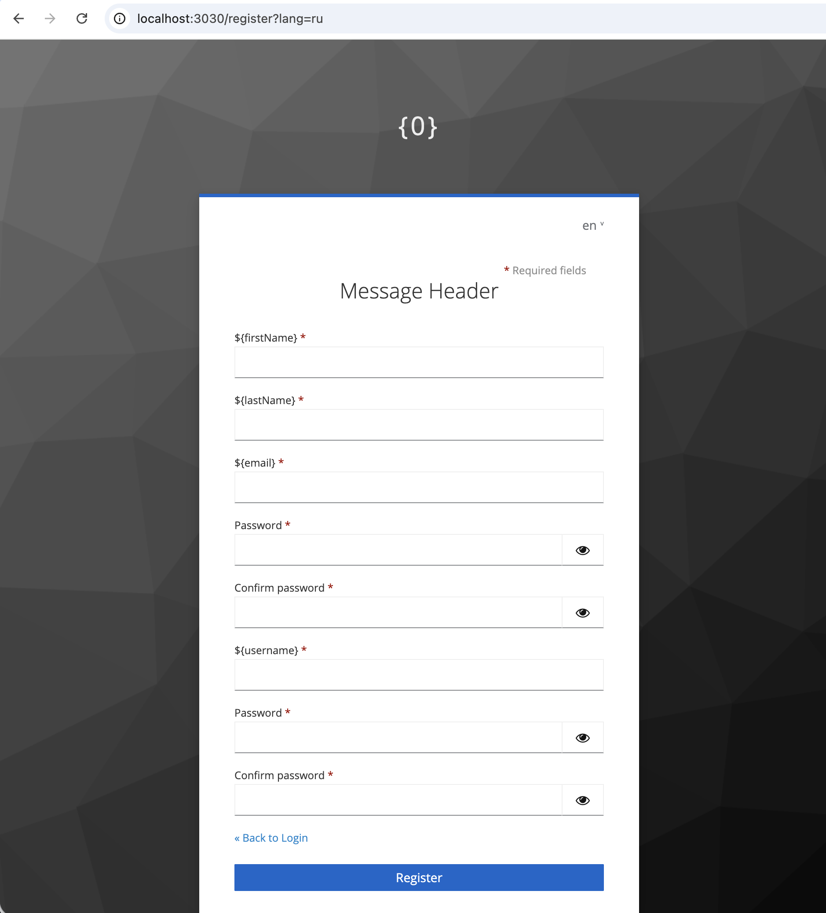

# Fitcloak

**Keycloak FreeMarker थीम** विकसित करने के लिए एक हल्का स्थानीय प्रीव्यू सर्वर — बिना Docker, डेटाबेस, या पूर्ण Keycloak इंस्टेंस चलाए।

[शुरू करें](./quick-start){: .btn .btn-primary .fs-5 .mb-4 .mb-md-0 .mr-2 }
[GitHub पर देखें](https://github.com/msotnikov/fitcloak){: .btn .fs-5 .mb-4 .mb-md-0 .mr-2 }
[Patreon पर सहयोग करें](https://www.patreon.com/msotnikov/gift){: .btn .fs-5 .mb-4 .mb-md-0 }

---

## यह कैसे काम करता है

Fitcloak एक स्थानीय सर्वर है जो **Keycloak से अलग चलता है**। केवल Java 17+ आवश्यक है।

1. आप एक थीम बनाते या संपादित करते हैं — मानक `.ftl` टेम्पलेट, CSS, JS
2. Fitcloak टेम्पलेट को Keycloak की उसी इनहेरिटेंस चेन का उपयोग करके असेंबल करता है (`Base → Parent → Child`)
3. यह टेस्ट डेटा को प्रतिस्थापित करता है और रेंडर किए गए पेज को आपके ब्राउज़र में दिखाता है
4. जब थीम तैयार हो — इसे Keycloak में कॉपी करें और एडमिन कंसोल में चुनें
5. वैकल्पिक रूप से, आप किसी भी वेब फ्रेमवर्क के साथ तेज़ विकास के लिए बंडलर (Vite, Webpack, आदि) का उपयोग HMR (हॉट मॉड्यूल रिप्लेसमेंट) के लिए कर सकते हैं

## Fitcloak क्यों?

Keycloak के लॉगिन/अकाउंट/ईमेल पेजों को कस्टमाइज़ करने का मतलब आमतौर पर एक कठिन फीडबैक लूप होता है: JAR को फिर से बनाना, Keycloak को रीस्टार्ट करना, कैश साफ़ करना, पेज रिफ्रेश करना। Fitcloak यह सब खत्म कर देता है — बस अपनी फ़ाइल सेव करें और परिणाम देखें।

**कोई भी Keycloak टेम्पलेट लें, Fitcloak को उसकी ओर इंगित करें, और काम शुरू करें।** बिल्ट-इन डेव सर्वर प्रॉक्सी की बदौलत आप किसी भी फ्रंटएंड टूलचेन का उपयोग कर सकते हैं — Vite, Webpack, Parcel — किसी भी फ्रेमवर्क या प्रीप्रोसेसर के साथ: React, Vue, Svelte, SCSS, Tailwind, जो भी आप पसंद करें। FreeMarker पेज का ढांचा रेंडर करता है, आपके टूल फ्रंटएंड संभालते हैं, और HMR फीडबैक लूप को तात्कालिक बनाए रखता है।

यह आपको आधुनिक फ्रंटएंड विकास की पूर्ण लचीलापन देता है, जबकि आप Keycloak की नेटिव थीमिंग सिस्टम के भीतर रहते हैं: कोई कस्टम SPI नहीं, कोई वेंडर लॉक-इन नहीं — बस मानक `.ftl` टेम्पलेट जो किसी भी Keycloak इंस्टेंस पर जैसे-के-तैसे डिप्लॉय होते हैं।

## विशेषताएँ

- **तात्कालिक फीडबैक** — `.ftl` / `.css` / `.properties` संपादित करें, ब्राउज़र रिफ्रेश करें
- **पूर्ण इनहेरिटेंस** — Keycloak की `Base -> Parent -> Child` थीम चेन का अनुकरण करता है
- **Vite/HMR इंटीग्रेशन** — हॉट मॉड्यूल रिप्लेसमेंट के लिए डेव सर्वर प्रॉक्सी
- **डायनामिक टेस्टिंग** — URL क्वेरी पैरामीटर के माध्यम से किसी भी टेम्पलेट वेरिएबल को ओवरराइड करें
- **डैशबोर्ड** — इनहेरिटेंस विज़ुअलाइज़ेशन और QA लिंक के साथ टेम्पलेट ब्राउज़र
- **शून्य इन्फ्रास्ट्रक्चर** — बस Java और Gradle, और कुछ नहीं

### Fitcloak बनाम Keycloakify

| | Fitcloak | [Keycloakify](https://github.com/keycloakify/keycloakify) |
|---|---|---|
| **दृष्टिकोण** | नेटिव FreeMarker टेम्पलेट + कोई भी फ्रंटएंड टूलिंग | React कंपोनेंट जो थीम में कंपाइल होते हैं |
| **उपयोग का मामला** | आधुनिक DX के साथ मानक Keycloak थीम को कस्टमाइज़ करना | React से पूरी तरह नई UI बनाना |
| **फ्रंटएंड** | कोई भी फ्रेमवर्क (React, Vue, Svelte, Alpine.js, vanilla) या कोई नहीं | केवल React/TypeScript |
| **सीखने की अवस्था** | FreeMarker जानते हैं = काम के लिए तैयार | React/TypeScript का ज्ञान आवश्यक |
| **आउटपुट** | मानक थीम डायरेक्टरी (किसी भी Keycloak पर काम करती है) | कंपाइल किए गए React ऐप के साथ JAR |

Keycloakify एक अलग रास्ता अपनाता है: यह FreeMarker को पूरी तरह से React SPA से बदल देता है और इसकी अपनी बिल्ड पाइपलाइन है। Fitcloak Keycloak की मानक थीमिंग सिस्टम के साथ काम करता है — वही `.ftl` टेम्पलेट, वही डिप्लॉयमेंट, बस एक बहुत बेहतर विकास कार्यप्रवाह।

### 

